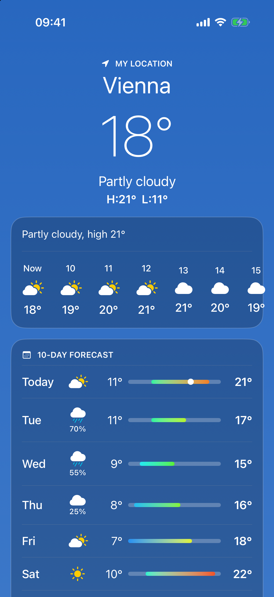

# Daybook

One personal daily app, built in public, shipped natively on each platform from one Rust core.

Morning weather for the family, news without paywalls, voice notes that don't get lost, steps while walking, a shared family and client calendar. Nothing novel as a product. The point is to build the same familiar surfaces four times and show the tradeoffs.

## Why four times

| Client | Purpose |
|---|---|
| SwiftUI (iOS) | Reference build. Correct platform behavior first. |
| Kotlin + Compose (Android) | Second native reference. |
| React Native | Same features, measure what the shared layer buys and costs. |
| Flutter | Same again. Last, and only if the first three land. |

Sensors, audio, AR and BLE stay native on every client. Business logic lives in a Rust core exposed through UniFFI.

## Phases

Order is fixed, timing is not. Each phase ships to TestFlight and Play before the next starts.

1. **Weather** — Open-Meteo, current + hourly + 10-day, local cache, CI from day one.
2. **News** — public RSS only, dedupe, rank by freshness and engagement, preference weights with a forgetting curve.
3. **Notes** — offline-first, local DB + sync queue, voice to structured note. AI last: cloud streaming vs on-device, both shown, tradeoff documented.
4. **Health** — pedometer, HealthKit / Health Connect, widget.
5. **Calendar** — shared family + client calendar, walk-vs-desk tags, natural-language scheduling.
6. **Recommendations** — same default feed, personalised by topic weights. No follow graph.

## Backend

FastAPI, Postgres + pgvector, Redis, AWS. Arrives with phase 2; phase 1 is client-only.

## Status

Phase 1, iOS, step 4 of 6. A store serves the last forecast from a file cache, refreshes from Open-Meteo, survives corrupt files and no network, and keeps saved cities in Application Support. The screen gets live data and location in step 5.


## Build log

| Date | Entry |
|---|---|
| 2026-09-11 | Repo created. Scope and phase order fixed. |
| 2026-09-19 | iOS step 1: two local Swift packages, XcodeGen app target, Makefile, layer lint, GitHub Actions test job. |
| 2026-09-19 | iOS step 2: weather model, day summary rules, theme, formatter, WeatherView in all states, snapshot tests. |
| 2026-09-19 | iOS step 3: Open-Meteo provider, geocoding, zone-correct mapping, per-test URL stubs, nightly live schema check. |
| 2026-09-19 | iOS step 4: forecast file cache, saved locations file, LiveWeatherStore, contract tests over a stubbed network, debug fixture provider. |

## Layout

```
daybook/
├── core/        Rust, UniFFI bindings
├── ios/         SwiftUI
├── android/     Kotlin, Compose
├── rn/          React Native
├── flutter/     Flutter
└── backend/     FastAPI
```

Folders appear when their first commit lands, not before.

## License

MIT © 2026 Replicant Studio
